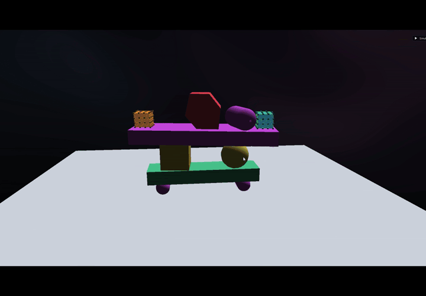
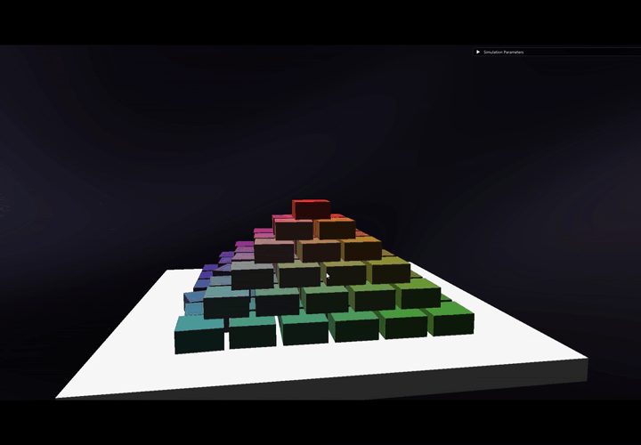
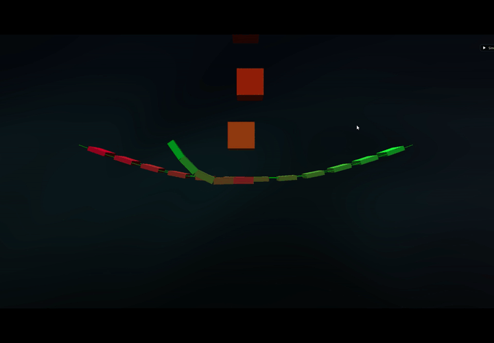
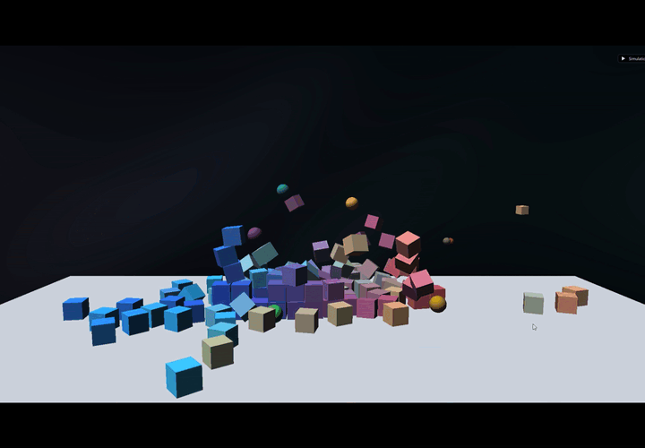
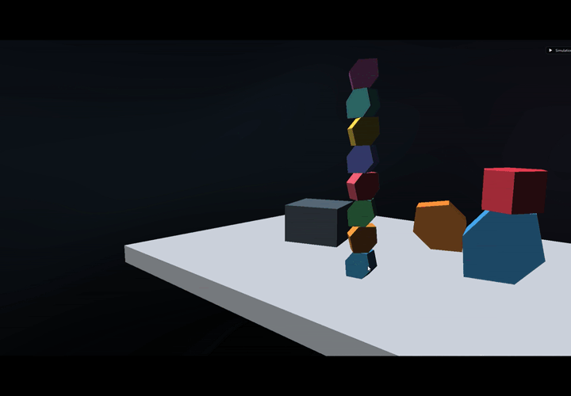
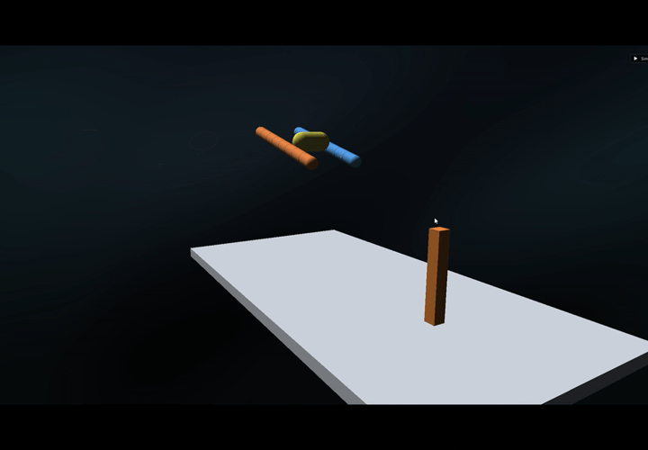

# SkyePhyX

**Version:** 1.0.0

SkyePhyX is a real-time 3D physics engine built on the AVBD (augmented vertex block descent) solver paper by Chris Gale and Cem Yuksel. Initially built in 2D for a research project, I went all the way to port it into a complete 3D beginner engine with tons of improvements.

## Showcase

| | | |
| --- | --- | --- |
|  |  |  |
|  |  |  |
|  |  |  |

## What does it do

AVBD is a primal-dual solver relying on Lagrangian augmented terms to tackle complex energy definitions such as rigidBody collisions. It also enables to easily parametrize the context in order to have better control on efficiency / realism for real time applications.

I have hardcoded different levels showcasing the usefulness of such a solver for different scenarios.

## What does it have

It contains the following added features:

- Real time RigidBody solver (manifold, ropes, spring, joint...).
- Real time SoftBody and cloth simulation integration (StVK, Neo-Hookean energies).
- Real time collision detection for spheres, capsules, cubes or any convex shape (with quick hull generation).
- Manifold contact generation and preservation (GJK and SAT algorithms).
- Very simple graphics made with native dawn WebGPU.

## Where can I test it

You can build the project in Linux or Windows. But even better, if your browser supports WebGPU (Chrome or Firefox), you can play here: https://skyepulse.github.io/projects/SkyePhyX/SkyePhyX.html. It should even work on mobile phones.

P.S. This is a small experiment project, should not be taken as a fully fleshed integrable engine. There are far better engines out there such as Jolt or React3D, this was mostly a project to implement and augment the AVBD original paper.

## Report

[Open the full report](report.pdf)

<object data="report.pdf" type="application/pdf" width="100%" height="720">
  
PDF preview unavailable. <a href="report.pdf">Open the full report</a>.

</object>